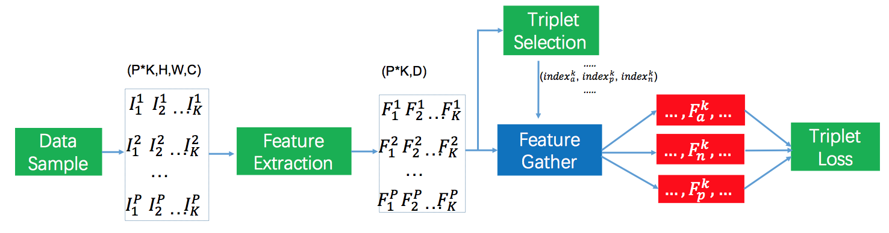

# MassFace: an effecient implementation using triplet loss for face recognition.

## Introduction
This project provide an efficient implementation for deep face recognition using Triplet Loss. When trained on [CASIA-Webface](http://www.cbsr.ia.ac.cn/english/CASIA-WebFace-Database.html) and tested on on [LFW](http://vis-www.cs.umass.edu/lfw/),this code can achieve an 98.3% accuracy with softmax pretrain and 98.6% with CosFace pretrain. The framework using triplet loss can be seen as the following figure. It contrains Data Sample, Feature Extractor, Triplet Selection and Triplet Loss modules. The details can be seen as our technical report [**MassFace: an effecient implementation using triplet loss for face recognition**]()

| |
|:--:|
| *Framework using triplet loss to train face recognition model: total P ∗ K images are sampled for P persons with K images each person. The sampled images are mapped into feature vectors through deep convolutional network. The indexs of triplet pairs are computed by a hard example mining process based on the feature vectors and the responding triplet feature pairs can be gathered. Finally, the features of triplet pairs are inputed into triplet loss to train the CNN.* |

**Data Sample**: we sample total P*K images for P persons with K images each in an iteration.

**Feature Extractor**: We use MobileFacenets [1] to extract the feature of the input image as a deep representation. It only has 4.0MB parameters and can be infered very fast as well.

**Triplet Selection**: Triplet selection aims to choice the valid triplet (i, j, k) which is used as input of triplet loss. The valid triplet menas that i, j have the identity and i, k have different identity. We implement serveral mining strategy to select triplet pairs.
- Batch All
- Batch Random
- Batch Min Min
- Batch Min Max
- Batch Hardest

**Triplet Loss**: 


**Mining methods**:The triplet selection is based on a pool of the feature vectors. There are serveral methods to obtain the pool of feature vectors with size B
- Online
- Offline
- Semi-online

## Installation
- Install tensorflow 1.8: ```pip install tensorflow==1.8.0```
- Get code of this respository: ```git clone https://github.com/yule-li/MassFace.git```

## Data preprocessing

- Align webface and lfw dataset to ```112x112```([casia-112x112](https://pan.baidu.com/s/1MYNq6pkZJCkpKERC92Ea1A),[lfw-112x112](https://pan.baidu.com/s/1-QASgnuL0FYBpzq3K79Vmw)) using [insightface align method](https://github.com/deepinsight/insightface/blob/master/src/align/align_lfw.py)
- If you want to train this code on your dataset, you just need to keep your dataset having the same directory like webface in which all images of the same identity located in one folder.

## Train
- Pretrain with softmax loss: run ```./train_softmax.sh``` with argument ```NETWORK=mobilenet```
- Train with triplet loss: run ```./train_triplet.sh```
## Test
- Modify ```MODEL_DIR``` in ```test.sh``` to your trained model
- ```./test.sh```

## Reference
1. [MoibleFaces](https://arxiv.org/pdf/1804.07573)
2. [MobileFaceNet_TF](https://github.com/sirius-ai/MobileFaceNet_TF)
3. [CosFace](https://github.com/yule-li/CosFace)
